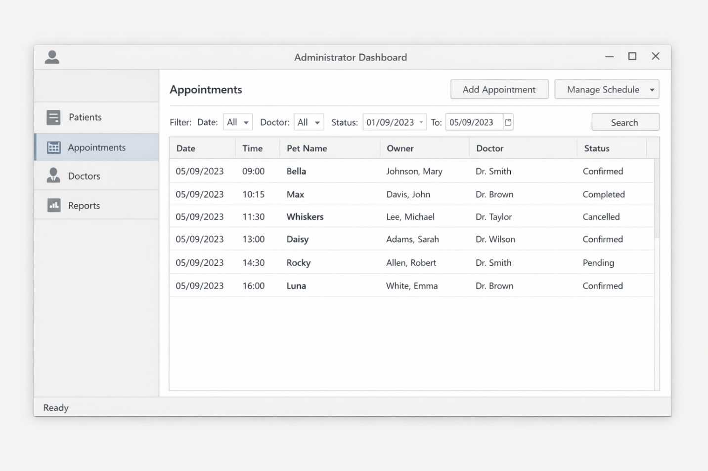
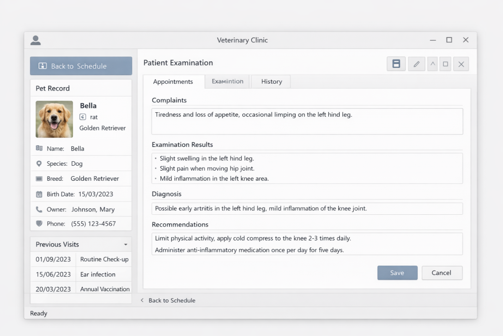
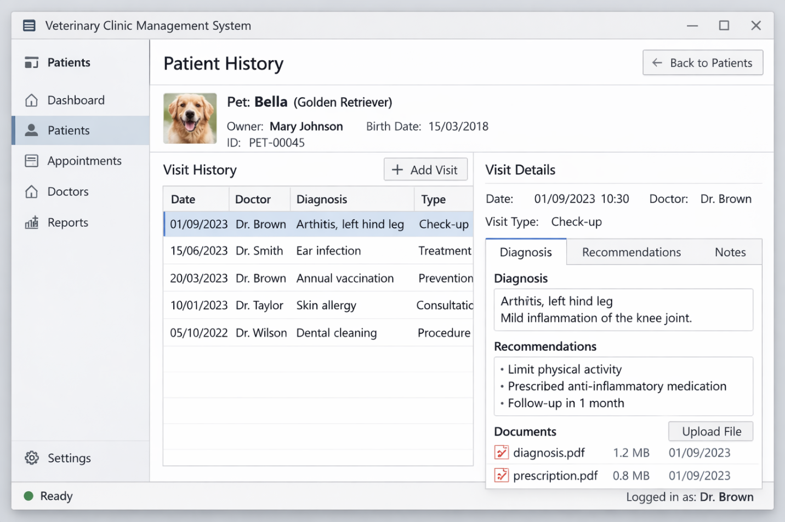
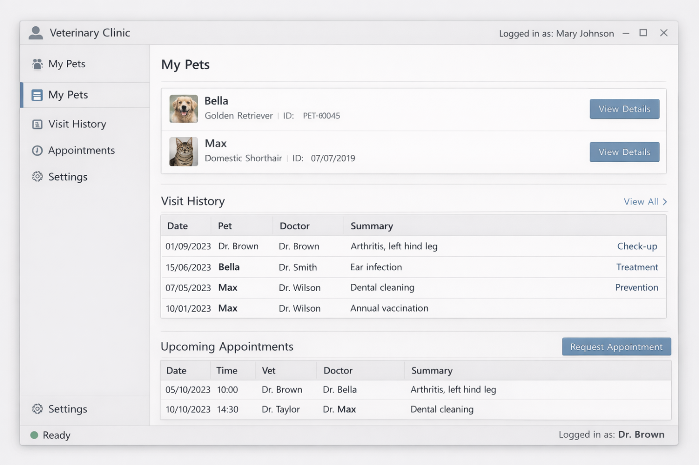

# 🐾 Информационная система управления деятельностью ветеринарной клиники

Данный проект разработан в рамках выпускной квалификационной работы.

---

## 📌 Назначение системы

Система предназначена для автоматизации ключевых процессов ветеринарной клиники:

* ведение базы владельцев животных
* управление карточками пациентов
* запись на приём
* фиксация результатов осмотра
* хранение истории лечения
* формирование аналитических отчётов

---

## 🏗 Архитектура системы

Система реализована по клиент-серверной архитектуре.

* серверная часть — **ASP.NET Core Web API**
* клиентская часть — **WPF-приложение**
* база данных — **PostgreSQL**

Бизнес-логика вынесена в сервисный слой, что обеспечивает расширяемость системы.

---

## 🛠 Технологический стек

* ASP.NET Core (.NET 8)
* Entity Framework Core
* PostgreSQL
* WPF
* C#

---

## 📊 Основные модули

* пользователи и роли
* владельцы животных
* пациенты
* запись на приём
* ведение приёма
* история посещений
* отчёты

---

## 🗄 Структура базы данных

Основные сущности:

* users
* owners
* pets
* doctors
* appointments
* visits
* services
* appointment_services

---

## 🖥 Демонстрация интерфейса

### Управление записями на приём

### Проведение приёма

### История пациента

### Личный кабинет владельца

---

## ⚙ API (пример)

* `POST /api/appointments` — создание записи
* `GET /api/appointments/{id}` — получение записи

---

## 📄 Примечание

Репозиторий содержит демонстрационные материалы и ключевые компоненты системы, разработанной в рамках ВКР.
